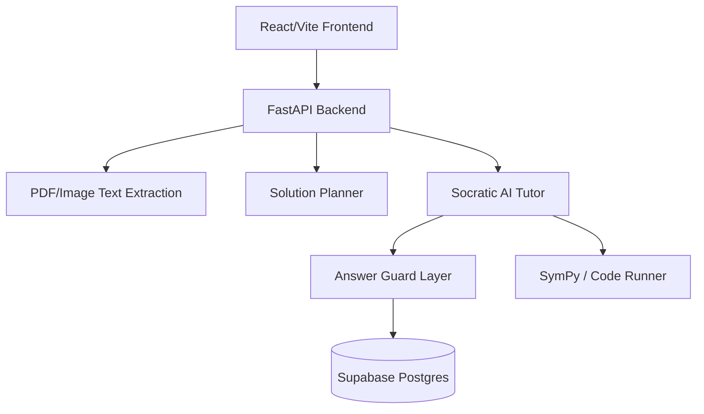

# Curio

A universal academic problem-solving and Socratic tutoring platform. It supports mathematics, physics, chemistry, biology, CS, and humanities, guiding students through their reasoning without ever giving the final answer.

## Architecture



## How to Add a New Subject Pack
1. Navigate to `backend/subjects/`.
2. Create a new file (e.g., `history.py`).
3. Expose the required hooks:
   - `prompt_additions(problem_type)`
   - `seed_concepts()`
   - `guard_strategy()`
   - `render_hints()`
4. Update the router in the backend to register the new subject pack.

## Socratic tutoring contract

Every tutoring turn should advance the student's understanding of the exact task,
not merely ask a generic question. The tutor must preserve named people, places,
dates, quantities, and requested outcomes; read the recent conversation; and
interpret repeated questions or "I don't know" as a request for clearer scaffolding.
It should provide a useful prerequisite, clue, principle, or worked reasoning
step, then ask one specific question the student can answer without already
knowing the withheld final answer. Hints should become more concrete when the
student is stuck. Each question must probe the explanation just given, not test
unrelated recall or disguise a request for the same unknown answer. For factual
and current-affairs questions, keep the exact people, places, and timeframe;
keep the work in the tutoring conversation rather than offloading the
answer-finding task. If potentially changing information may be
out of date, say so briefly, teach a stable related concept, and ask a question
the student can answer from that explanation. Classification labels are
guidance, not a reason to reject broad academic queries or force non-math
questions into a math category.

Typed questions go directly to session creation without a separate AI
classification request. At session start, the solution planner uses the exact
question to prepare a private assessment plan and a Socratic learning map. The
map includes a question-specific learning objective, prerequisite concepts, and
directed prerequisite links; the tutor uses those same concepts to scaffold
reasoning without giving away the answer. Map output is checked for missing,
unrelated, duplicate, or cyclic concepts before the session is saved. If
planning is unavailable, the provider quota is exhausted, or the map is
invalid, session creation reports the error rather than showing a generic or
fabricated map. Uploaded files still use text extraction, followed by an
editable review before the session starts.

## Environment Variables
Create a `.env` file in the `backend/` directory:
```env
OPENAI_API_KEY=your_key_here
OPENAI_BASE_URL=https://openrouter.ai/api/v1
OPENAI_MODEL=qwen/qwen3.7-flash
OPENAI_VISION_MODEL=qwen/qwen3.7-flash
SUPABASE_URL=your_supabase_url
SUPABASE_ANON_KEY=your_supabase_anon_key
SUPABASE_SERVICE_ROLE_KEY=your_supabase_service_role_key
API_ALLOWED_ORIGINS=http://localhost:5173,http://127.0.0.1:5173
```

Create `frontend/.env` from `frontend/.env.example` and set the API origin and Supabase public project credentials. Never place the Supabase service-role key in frontend variables.

In Supabase, enable email confirmation, configure the frontend URL and `/auth` redirect URL, and apply migrations `001_initial_schema.sql`, `002_universal.sql`, `003_student_accounts_and_rewards.sql`, and `006_remove_daily_challenge.sql` in order. Migration 006 also adds the session completion and tutor-personality fields required by the current app. Existing databases that applied historical migration 005 should apply 006 to remove the retired challenge, streak, and timezone schema. `OPENAI_VISION_MODEL` must name a model supported by the configured OpenAI-compatible provider that accepts image input; scanned PDFs and uploaded images need it.

Supabase requests share a thread-safe HTTP connection pool with keep-alive, verified TLS, and bounded connect/read timeouts to avoid creating a new TLS handshake for every request. Transient connection and TLS failures are retried for reads and idempotent writes; chat messages use a stable UUID upsert so a retry cannot duplicate a message. Other non-idempotent inserts are not blindly retried. Retries cannot prevent outages caused by Supabase or the network, but exhausted failures are surfaced as errors rather than silently treated as successful.

## Run Instructions

### Frontend (React/Vite)
```bash
cd frontend
npm install
npm run dev
```

### Backend (FastAPI)
```bash
pip install -r backend/requirements.txt
uvicorn backend.main:app --reload --port 8000
```

## Free-tier deployment (Vercel + Render)

The repository includes a Vercel SPA rewrite in `frontend/vercel.json` and a Render Blueprint in `render.yaml`. This deployment uses the free tiers where available; free-service limits and provider policies can change. Render's free backend may sleep when idle and take time to wake on the first request.

1. Push this project to a GitHub repository you control. Do not commit either `.env` file or any API/service-role keys.
2. In Render, create a new Blueprint from that repository and deploy the `curio-api` web service from `render.yaml`. Enter the prompted secret values for `OPENAI_API_KEY`, `SUPABASE_URL`, `SUPABASE_ANON_KEY`, and `SUPABASE_SERVICE_ROLE_KEY`. Confirm the selected AI provider/model has available quota; the configured sample model may be rate-limited. Keep the Supabase service-role key only in Render's backend environment.
3. In Vercel, import the same repository and set **Root Directory** to `frontend`. Use `npm run build` and `dist` if asked for the build command/output directory. Add `VITE_API_URL` as the deployed Render service origin (for example `https://curio-api.onrender.com`, without a trailing slash), plus `VITE_SUPABASE_URL` and `VITE_SUPABASE_ANON_KEY`. Redeploy after changing frontend environment variables because Vite embeds them at build time.
4. After Vercel provides the production domain, set Render's `API_ALLOWED_ORIGINS` to that exact origin (for example `https://your-app.vercel.app`, without a trailing slash) and redeploy/restart the API. Do not use `*` for production CORS.
5. In Supabase Auth URL Configuration, set the Site URL to the Vercel domain and add its `/auth` route to the allowed redirect URLs. Confirm the project's email-confirmation settings and callback links work on the deployed domain.
6. Verify `https://<render-service>.onrender.com/` returns `{"status":"ok"}`; then test sign-up/sign-in, session creation, tutor replies, PDF/image extraction, and password reset from the deployed Vercel site.

Render may prompt for secret environment variables while creating the Blueprint. Enter them in Render's dashboard; never paste them into chat, commit them, or expose the Supabase service-role key as a `VITE_` variable. The API uses the OpenAI-compatible provider configured by `OPENAI_BASE_URL`, `OPENAI_MODEL`, and `OPENAI_VISION_MODEL`; provider quotas/billing are separate from hosting and may not be free.

## Testing
Frontend has no test script configured yet. Verify its production bundle and lint:
```bash
cd frontend
npm run build
npm run lint
```

Run the backend's unittest suite:
```bash
python -m unittest discover -s backend/tests
```

## MVP-to-launch implementation plan

### MVP foundation (current implementation)
- Use a real API-created session ID for each tutoring session and send messages to that session endpoint.
- Carry the selected tutoring mode through to the backend prompt instructions.
- Support typed problems, text-based PDF extraction, and image/scanned-PDF OCR through the configured vision model, with editable extraction preview and file type/size/page limits.
- Keep release builds type-safe and configure the API origin through `VITE_API_URL`.
- Restrict local-development CORS to the frontend origins; override `API_ALLOWED_ORIGINS` for the deployed frontend.
- Require Supabase email sign-in for saved sessions; validate bearer tokens on the backend and apply user ownership filters to session reads/writes.
- Keep assessment plans server-side. New direct-start sessions currently use a non-verifiable plan, so verified completion and rewards are not available for them; restore AI-planned assessment only with robust handling for broad questions and provider failures.
- Save concept evidence and misconceptions with each session, restore sessions across sign-in, offer AI-generated transfer practice, and provide an account-data deletion flow.

The Supabase migrations must be applied and backend service-role credentials configured before persistent sessions, history, account deletion, or rewards work.

To add a tutor personality, add a safe tone-only entry to `PERSONALITY_TONES` in `backend/prompts/socratic_tutor.py` and add its matching typed option, card/sample and profile validation in the frontend/backend. Keep the personality block after the existing tutoring rules and problem strategy. Do not change the answer guard, hint/reveal logic, verifier or mastery pipeline.

### Before inviting students
1. Add subject-specific verifiers for physics, chemistry, code, essays, proofs, and generated transfer questions. Rewards and verified completion currently apply only to simple one-variable equations; code is discussed but never executed.
2. Add production request/rate limits, monitoring and alerting, backups, deployment/health checks, and operational recovery procedures. Restrict `API_ALLOWED_ORIGINS` to the deployed site.
3. Choose the initial country/grade/curriculum, then author aligned lessons, practice, and prerequisite maps; validate completion and next-step recommendations with actual students.
4. Before serving minors, complete jurisdiction-specific privacy, data-retention, and parental-consent review; publish accurate privacy/terms documents and make AI-provider data handling clear to students and guardians. The account deletion flow is implemented, but it does not replace this review.
5. Run end-to-end staging tests against a dedicated Supabase project and a configured vision-capable AI model. No production credentials or deployment target are included in this workspace.

### Student-focused differentiation and rewards
- Keep rewards private and non-monetary. Points are server-awarded and idempotent, tied to a verified answer and reduced after tutor hints—not time-on-site or message volume.
- Daily challenges and an optional private independent-solve streak add a lightweight routine; avoid streak-loss guilt, public leaderboards, friend systems, or prize redemption in the initial student release.
